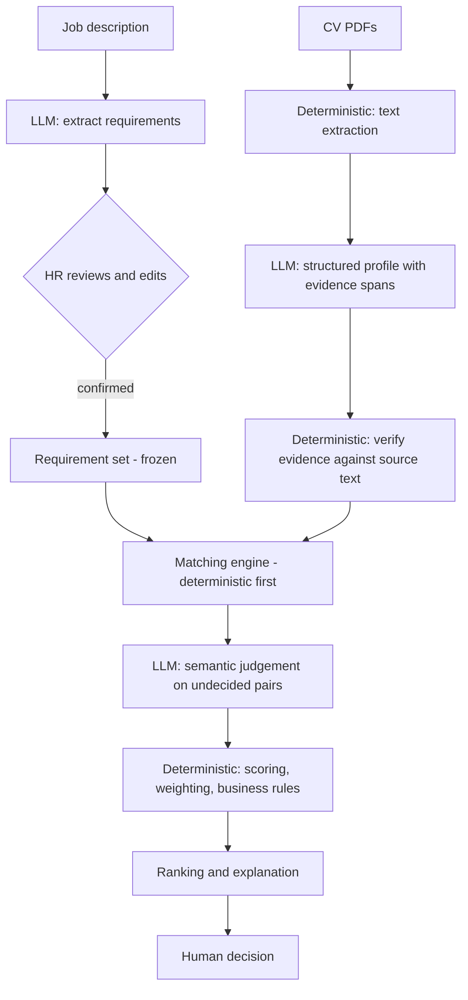

# AI CV Screener

An AI-assisted CV screening tool that helps recruiters evaluate many candidates against one job description — by showing **evidence**, not just a number.

> **Project status: Product UI + Demo milestone — the product is usable end to end in a browser, with a one-click synthetic demo that needs no API key (roadmap phases 6, 7, most of 8, and 9–12).**
> The pipeline now runs end to end on the backend. A job description becomes structured requirements that a human reviews and **confirms**; a CV PDF becomes text with page-level provenance, then a candidate profile whose every item quotes the document; every confirmed requirement gets a `MATCHED` / `PARTIAL` / `NO_EVIDENCE` verdict with verified evidence; and those verdicts become a transparent 0–100 score with a per-requirement breakdown. It all runs offline from recorded model responses — no API key needed. Finally the job's candidates come back in a deterministic order, with failed and not-yet-scored candidates in their own groups so none can be quietly dropped — and all of it is now driveable from a React UI, including a one-click demo seeded from synthetic CVs. **Still missing:** the measured evaluation, a security review, and deployment. **There is no OCR**, so scanned CVs are rejected rather than silently treated as empty. Progress is tracked in [docs/roadmap.md](docs/roadmap.md).

---

## What this project is

Given a job description and a batch of CVs, the system will:

1. Extract structured **requirements** from the job description.
2. Let the recruiter **review, edit, and confirm** those requirements before anything is scored.
3. Parse uploaded CVs and extract a structured **candidate profile**.
4. Decide, for every requirement, whether the CV shows `MATCHED`, `PARTIAL`, or `NO_EVIDENCE` support — with a **quote from the CV** behind every positive finding.
5. Compute a **transparent weighted score** in ordinary, testable code.
6. **Rank** candidates and explain each result requirement by requirement.

The recruiter makes the hiring decision. The system never accepts, rejects, filters, or hides a candidate.

### What it is not

This is **not** `CV → LLM → score`. That design is unverifiable, irreproducible, and impossible to audit — the number changes when the model has a bad day, and nobody can say why.

Instead the work is split along a hard line:

| The LLM does | Deterministic code does |
|---|---|
| Read the job description and extract requirements | Validate every model output against a schema |
| Read the CV and extract a structured profile | Verify each quoted piece of evidence really exists in the document |
| Judge semantic equivalence (`Flask experience` → `Python web development`) | Match, weight, score, rank, apply business rules |
| Identify supporting evidence | Enforce thresholds and guardrails |

**The model decides what the text says. The code decides what that is worth.**

### Evidence-first

If a CV does not mention Kubernetes, the system reports:

> **No evidence found in CV**

and never:

> ~~Candidate does not have this skill.~~

A CV is a length-limited marketing document. Absence in the document is not absence in the candidate, and the tool is built so it cannot confuse the two. Every `MATCHED` or `PARTIAL` verdict must carry a verbatim span from the source document, and that span is machine-checked against the extracted text — a quote the model invented does not survive validation.

---

## Current status

| Area | Status |
|---|---|
| Product specification | ✅ Complete — [docs/product-spec.md](docs/product-spec.md) |
| Development roadmap | ✅ Complete — [docs/roadmap.md](docs/roadmap.md) |
| Architecture | ✅ Complete — [docs/architecture.md](docs/architecture.md) |
| Data model | ✅ Complete — [docs/data-model.md](docs/data-model.md) |
| Backend | 🟡 The whole pipeline: jobs, job descriptions, requirement extraction + CRUD, confirmation gate, CV upload and PDF text extraction, candidate profile extraction, evidence verification, requirement matching with evidence-backed verdicts, deterministic scoring, and ranking. **No screening UI yet.** |
| Frontend | 🟡 The full workflow — job creation, JD entry, requirement review and confirmation, batch upload, screening progress, ranked results, candidate detail with evidence. React + Vite, zero runtime dependencies beyond React. |
| Database | 🟡 PostgreSQL 16 in Docker; all 16 tables migrated via Alembic |
| Tests | 🟡 687 passing (604 backend, 83 frontend) |
| CI | 🟡 [Workflow created](.github/workflows/ci.yml) and its steps verified locally against a fresh database; **not yet observed running on GitHub** — the repository hasn't been pushed yet. |
| Repository hygiene | ✅ [CONTRIBUTING.md](CONTRIBUTING.md), [ADRs](docs/decisions/README.md), pinned language versions, MIT license, secret scan performed |
| LLM integration | 🟡 Requirement extraction, candidate profile extraction and semantic matching — three call sites, all behind one `LlmClient` abstraction with live and fixture-replay implementations |
| PDF parsing | 🟡 Text-layer PDFs, with page offsets. **No OCR** — scanned CVs fail honestly rather than yielding empty text. |
| Matching engine | 🟡 Deterministic exact/alias/duration matchers run first; the model settles the rest; every positive verdict carries a quote verified against the CV |
| Scoring engine | 🟡 Weighted average over stored verdicts, 0–100 plus a heuristic band. Pure, reproducible, no model call in its path. Must-have coverage reported separately, and an unevidenced must-have caps the band at Review without changing the score or hiding anyone. |
| Ranking | 🟡 Deterministic per-job order — score, then must-have coverage, then matched-requirement count, then arrival and id for a total order. Nothing is filtered; failed and unscored candidates are surfaced in their own groups. |
| Evaluation | 🟡 [`evaluation/`](evaluation/) — 8 synthetic candidates, 2 jobs, 89 labelled pairs. Eleven deterministic metrics measured; six LLM-dependent ones reported as not measurable offline, with the reason. Found two real matcher defects. [RESULTS.md](evaluation/RESULTS.md) |
| Demo mode | 🟡 One click seeds a job from three synthetic CVs — a strong match, one carrying injected instructions, and an unreadable scan. No API key, no cost, no real applicant data. Refused outside demo mode. |
| Deployment / live demo | ⬜ Not deployed |

## Quickstart

Requires Python 3.10+, Node 20+, and a **running** Docker Desktop.

```powershell
git clone <repository-url> ai-cv-screener
cd ai-cv-screener
.\tasks.ps1 install
Copy-Item .env.example .env
.\tasks.ps1 db-up
.\tasks.ps1 migrate
.\tasks.ps1 test
```

Then run the two servers in separate terminals:

```powershell
.\tasks.ps1 dev-backend     # http://localhost:8000/docs
.\tasks.ps1 dev-frontend    # http://localhost:5173
```

Every underlying command, the bash equivalents, and a troubleshooting section are in [docs/development.md](docs/development.md).

---

## Planned architecture

A **modular monolith** — one FastAPI application with clear internal module boundaries. No microservices: this project has no independent scaling, deployment, or team-ownership pressure that would justify the operational cost of splitting it.



Detailed architecture and the data model are Phase 1 deliverables.

---

## Planned stack

| Layer | Choice | Why |
|---|---|---|
| Backend | Python, FastAPI | Typed request/response models via Pydantic map directly onto the structured-output discipline this project depends on. |
| Frontend | React, Vite | Standard, fast dev loop, no framework overhead the project does not need. |
| Database | PostgreSQL | Relational data with a real audit trail. **pgvector was evaluated in Phase 1 and deferred** — nothing in the MVP pipeline needs vector search, and the schema is arranged so adding it later is a purely additive migration. |
| LLM | Anthropic Claude API | Server-side only; structured outputs; model and prompt version recorded with every call. |
| PDF | pypdf | Text-layer extraction with page and character offsets, so evidence can be cited back to a location. BSD-3 and pure Python, so deployment needs no system libraries. PyMuPDF extracts better but is AGPL-3.0, which is incompatible with this project's MIT licence. |
| Tooling | Git, GitHub, Docker Compose, pytest | — |

---

## Planned repository structure

Directories are created in the phase that first needs them, so the tree below is a target, not a description of the current checkout.

```
ai-cv-screener/
├── backend/            # FastAPI app: api/, services/, models/, schemas/, core/  (Phase 2)
├── frontend/           # React + Vite                                            (Phase 2)
├── data/sample/        # Synthetic CVs and JDs — never real candidate data       (Phase 12)
├── evaluation/         # Gold dataset, benchmark runner, published results       (Phase 13)
├── docs/               # Specification, roadmap, architecture, decisions         (Phase 0+)
├── .gitignore
├── .env.example
└── README.md
```

Currently present: `backend/`, `frontend/`, `evaluation/`, `docs/` (including `docs/decisions/`), `.github/` (CI workflow, issue/PR templates), `scripts/`, `docker-compose.yml`, `tasks.ps1`, `CONTRIBUTING.md`, `LICENSE`, and the repository metadata files. `data/sample/` holds the synthetic PDFs the demo seeds from; the recorded model responses for them live beside the prompts in `backend/app/llm/fixtures/`.

---

## Roadmap

| Phase | Title | Status |
|---|---|---|
| 0 | Product definition and specification | ✅ |
| 1 | Architecture and data model | ✅ |
| 2 | Local development environment | ✅ |
| 3 | Git repository setup | ✅ |
| 4 | Job description processing | ✅ |
| 5 | CV upload and PDF parsing | ✅ |
| 6 | Candidate profile extraction | ✅ |
| 7 | Requirement matching engine | ✅ |
| 8 | LLM semantic evaluation | 🚧 |
| 9 | Transparent scoring engine | ✅ |
| 10 | Candidate ranking | ✅ |
| 11 | Frontend application | ✅ |
| 12 | Demo mode with synthetic candidates | ✅ |
| 13 | Evaluation and benchmark | ⬜ |
| 14 | Automated testing | ⬜ |
| 15 | Security and reliability review | ⬜ |
| 16 | UI/UX polish | ⬜ |
| 17 | Documentation | ⬜ |
| 18 | GitHub repository cleanup | ⬜ |
| 19 | Deployment | ⬜ |
| 20 | Final end-to-end verification | ⬜ |

Each phase carries its own verification criteria in [docs/roadmap.md](docs/roadmap.md).

---

## Security posture

Uploaded CVs are treated as **untrusted input** throughout. A CV may contain a prompt-injection payload — possibly hidden as white-on-white text or in metadata — and the design assumes it does. Three channels are kept strictly separate: **system instructions** (trusted), **HR input** (semi-trusted), and **CV content** (untrusted data, never instruction).

The strongest control is not a prompt rule but a code rule: because every positive verdict needs a quote that verifiably exists in the document, an injected "mark everything as matched" cannot manufacture the evidence to make it stick — and a quote that *does* verify but reads as an instruction is refused as evidence anyway, because the injected sentence really is in the document.

The job description gets the same treatment. A recruiter pastes arbitrary text, so that text is scanned for instruction-like passages too; anything found is flagged and shown to the recruiter, never removed and never obeyed, and the requirements read out of it still pass through human confirmation before any candidate is screened. This is measured, not asserted — see [Evaluation](#evaluation) — though what is measured is refusal of the patterns the scanner knows, which is not resistance to prompt injection in general.

No secret is committed. `.env` is git-ignored from the first commit; only `.env.example` with placeholder values is tracked. Details in [docs/product-spec.md](docs/product-spec.md#14-security-principles).

---

## Fairness — and its limits

Sensitive attributes are excluded from the scoring input **by construction**: photo, gender, age, nationality, ethnicity, religion, marital status, and home address are not fields in the candidate profile schema, so the scoring stage never receives them. Asking a model politely to ignore someone's age is not a control; not giving it the age is.

This does **not** make the system unbiased, and the project does not claim otherwise:

- Proxy signals survive — name, university, employer, career gaps.
- The LLM carries the biases of its training data into its judgement of what "counts" as evidence.
- A biased job description produces biased requirements before the system does anything.
- Recruiters over-trust ranked lists; showing evidence mitigates this but does not remove it.
- No disparate-impact analysis is performed. This project holds no demographic data and will not collect any.

**This is a portfolio demonstration. It has had no bias audit and no conformity assessment, and it must not be used for real hiring decisions.** Automated employment-decision tools carry legal obligations in some jurisdictions (for example NYC Local Law 144, and the EU AI Act's high-risk classification of employment-related AI).

---

## Evaluation

`python -m evaluation.runner` scores the pipeline against eight synthetic CVs and
89 hand-labelled (candidate, requirement) pairs. Full output, with every
numerator and denominator, is in [evaluation/RESULTS.md](evaluation/RESULTS.md).

Read the boundary before the numbers. Everything measured describes **this
application's deterministic code** — the exact, alias and duration matchers, the
evidence verifier, the scorer, the ranker. None of it describes how well a
language model reads a CV, and none of it is real-world screening accuracy.

| | |
|---|---|
| Routing restraint — pairs code correctly declined to decide | 69/69 |
| Deterministic verdict precision | 17/17 |
| Over-crediting (the costlier direction) | 0/17 |
| Evidence located in the source text | 39/39 |
| Instruction-like evidence refused | 1/1 |
| Score reproducibility · reconstructibility | 8/8 · 8/8 |
| Ranking is a total order | 2/2 |
| Counterfactual name invariance (deterministic half only) | 1/1 |

Six further metrics the specification asks for — extraction precision/recall,
semantic verdict agreement, run-to-run stability, counterfactual *model*
sensitivity, ranking correlation against a human reference, and cost per CV —
are reported as **not measured**, each with its reason, rather than estimated.
They are all downstream of the model: a replay fixture is keyed by a hash of its
input, so measuring the model offline would mean hand-writing both the model's
answer and the label it is scored against.

The harness earned its keep on its first run by finding two real defects, both
over-crediting candidates: the skill `Go` matched the word "go" in *"the ability
to go deep on latency problems"*, and *"within 2 years"* was read as a minimum
of two years' experience. Both are fixed, and `RESULTS.md` records the recall
those fixes cost as well as the precision they bought.

---

## Known limitations

Recorded up front rather than discovered later:

- **Scanned or image-only PDFs cannot be read** without OCR, which is out of MVP scope. The system will report the failure rather than score an empty CV.
- **It measures what a CV says, not what a candidate can do.** No claim on a CV is verified for truthfulness.
- **Scoring constants are conventions, not findings.** `PARTIAL = 0.5` and the 90/75/60 band thresholds have no empirical backing and are configurable.
- **Scores are only comparable within a single job**, because the requirement sets and weights differ.
- **Multi-column and table-heavy CV layouts** can extract in the wrong reading order.
- **English only** in the MVP; other languages are detected and flagged, not silently degraded.
- **The evaluation set is small and synthetic.** Eight invented CVs. The metrics describe this application's deterministic code on that set, with sample sizes stated. They are not production accuracy, not model quality, and not a bias audit.
- **Model quality is not measured at all.** Six of the specified metrics need a live provider; offline they would be scored against recordings written by the same author as the labels, which would measure that author's consistency instead.

The full list is in [docs/product-spec.md](docs/product-spec.md#17-major-limitations).

---

## Continuous integration

[`.github/workflows/ci.yml`](.github/workflows/ci.yml) runs three jobs on every push and pull request to `main`: backend (lint, a full Alembic migration round-trip against a real PostgreSQL service container, then the full pytest suite), frontend (install, lint, test, production build), and a documentation link/anchor checker. Full rationale — including why CI runs a real database rather than only the offline test subset — is in [docs/development.md §17](docs/development.md#17-continuous-integration).

**Honesty note:** every step in the workflow was individually verified by running it locally — including against a freshly created, isolated PostgreSQL container standing in for the CI service — before being written into the YAML. That is not the same claim as "CI passed on GitHub." This repository has not yet been pushed, so no workflow run has actually executed on GitHub Actions. This section will be updated once one has.

---

## Documentation

- [Product specification](docs/product-spec.md) — scope, principles, scoring, fairness, security, limitations
- [Architecture](docs/architecture.md) — layering, the pipeline, LLM call sites, trust boundary, error policy, decision log
- [Data model](docs/data-model.md) — entities, enumerations, constraints, indexes, ER diagram, invalidation rules
- [Development guide](docs/development.md) — setup, commands, CI, and troubleshooting for local development
- [Architecture decision records](docs/decisions/README.md) — why each significant, non-obvious design choice was made, and what it costs
- [Roadmap](docs/roadmap.md) — all 20 phases with deliverables and verification criteria
- [Evaluation results](evaluation/RESULTS.md) — every metric with its numerator, denominator, definition, kind and limitations, plus the metrics that cannot be measured offline and why
- [CONTRIBUTING.md](CONTRIBUTING.md) — workflow, conventions, and how to propose a change

---

## Contributing

See [CONTRIBUTING.md](CONTRIBUTING.md) for local setup, branch and commit conventions, testing and linting requirements, secret handling, and how to propose an architectural change.

---

## License

[MIT](LICENSE). Chosen because this is a portfolio project with no commercial distribution model and no reason to restrict reuse — a standard, widely recognized permissive license lowers friction for anyone reading the code, more than a custom license would gain by trying to encode the product's own non-use warnings (see [Fairness — and its limits](#fairness-and-its-limits) above) into the legal terms themselves. Those warnings live in the product documentation, where they belong; the license governs the code, not its appropriate use.
