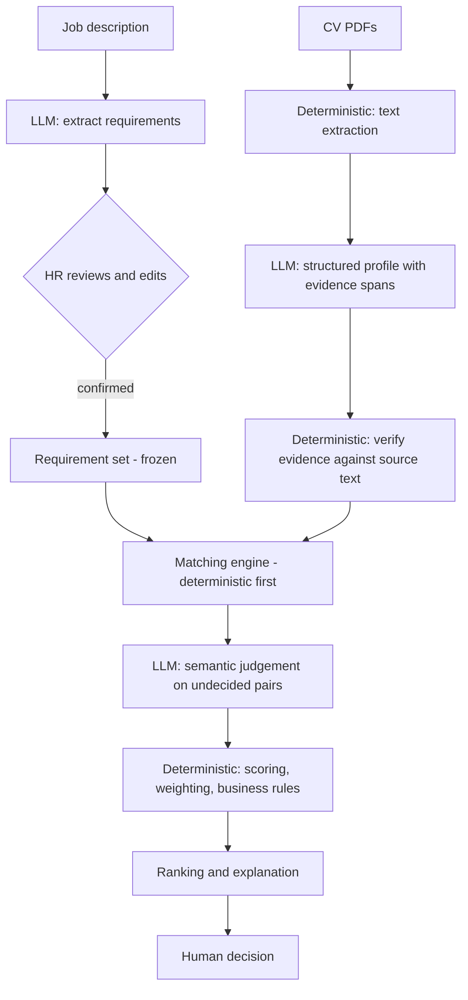

# AI CV Screener

An AI-assisted CV screening tool that helps recruiters evaluate many candidates against one job description — by showing **evidence**, not just a number.

> **Project status: Phase 2 of 20 — local development environment.**
> The application skeleton runs: a FastAPI backend with health endpoints, a migrated PostgreSQL schema, and a React shell that reports backend connectivity. **None of the CV screening pipeline is implemented** — no job description processing, no PDF parsing, no matching, no scoring. Everything described under "What this project is" is still *planned*. Progress is tracked in [docs/roadmap.md](docs/roadmap.md).

---

## What this project is

Given a job description and a batch of CVs, the system will:

1. Extract structured **requirements** from the job description.
2. Let the recruiter **review, edit, and confirm** those requirements before anything is scored.
3. Parse uploaded CVs and extract a structured **candidate profile**.
4. Decide, for every requirement, whether the CV shows `MATCHED`, `PARTIAL`, or `NO_EVIDENCE` support — with a **quote from the CV** behind every positive finding.
5. Compute a **transparent weighted score** in ordinary, testable code.
6. **Rank** candidates and explain each result requirement by requirement.

The recruiter makes the hiring decision. The system never accepts, rejects, filters, or hides a candidate.

### What it is not

This is **not** `CV → LLM → score`. That design is unverifiable, irreproducible, and impossible to audit — the number changes when the model has a bad day, and nobody can say why.

Instead the work is split along a hard line:

| The LLM does | Deterministic code does |
|---|---|
| Read the job description and extract requirements | Validate every model output against a schema |
| Read the CV and extract a structured profile | Verify each quoted piece of evidence really exists in the document |
| Judge semantic equivalence (`Flask experience` → `Python web development`) | Match, weight, score, rank, apply business rules |
| Identify supporting evidence | Enforce thresholds and guardrails |

**The model decides what the text says. The code decides what that is worth.**

### Evidence-first

If a CV does not mention Kubernetes, the system reports:

> **No evidence found in CV**

and never:

> ~~Candidate does not have this skill.~~

A CV is a length-limited marketing document. Absence in the document is not absence in the candidate, and the tool is built so it cannot confuse the two. Every `MATCHED` or `PARTIAL` verdict must carry a verbatim span from the source document, and that span is machine-checked against the extracted text — a quote the model invented does not survive validation.

---

## Current status

| Area | Status |
|---|---|
| Product specification | ✅ Complete — [docs/product-spec.md](docs/product-spec.md) |
| Development roadmap | ✅ Complete — [docs/roadmap.md](docs/roadmap.md) |
| Architecture | ✅ Complete — [docs/architecture.md](docs/architecture.md) |
| Data model | ✅ Complete — [docs/data-model.md](docs/data-model.md) |
| Backend | 🟡 Skeleton runs — FastAPI, typed settings, health endpoints. No pipeline routes. |
| Frontend | 🟡 Shell runs — React + Vite, reports backend connectivity. No screening UI. |
| Database | 🟡 PostgreSQL 16 in Docker; all 16 tables migrated via Alembic |
| Tests | 🟡 47 passing (32 backend, 15 frontend). Infrastructure only. |
| LLM integration | ⬜ Not implemented |
| PDF parsing | ⬜ Not implemented |
| Scoring engine | ⬜ Not implemented |
| Evaluation | ⬜ Not implemented |
| Deployment / live demo | ⬜ Not deployed |

## Quickstart

Requires Python 3.10+, Node 20+, and a **running** Docker Desktop.

```powershell
git clone <repository-url> ai-cv-screener
cd ai-cv-screener
.\tasks.ps1 install
Copy-Item .env.example .env
.\tasks.ps1 db-up
.\tasks.ps1 migrate
.\tasks.ps1 test
```

Then run the two servers in separate terminals:

```powershell
.\tasks.ps1 dev-backend     # http://localhost:8000/docs
.\tasks.ps1 dev-frontend    # http://localhost:5173
```

Every underlying command, the bash equivalents, and a troubleshooting section are in [docs/development.md](docs/development.md).

---

## Planned architecture

A **modular monolith** — one FastAPI application with clear internal module boundaries. No microservices: this project has no independent scaling, deployment, or team-ownership pressure that would justify the operational cost of splitting it.



Detailed architecture and the data model are Phase 1 deliverables.

---

## Planned stack

| Layer | Choice | Why |
|---|---|---|
| Backend | Python, FastAPI | Typed request/response models via Pydantic map directly onto the structured-output discipline this project depends on. |
| Frontend | React, Vite | Standard, fast dev loop, no framework overhead the project does not need. |
| Database | PostgreSQL | Relational data with a real audit trail. **pgvector was evaluated in Phase 1 and deferred** — nothing in the MVP pipeline needs vector search, and the schema is arranged so adding it later is a purely additive migration. |
| LLM | Anthropic Claude API | Server-side only; structured outputs; model and prompt version recorded with every call. |
| PDF | Python text-extraction library (selected in Phase 5) | Text-layer extraction with page and character offsets, so evidence can be cited back to a location. |
| Tooling | Git, GitHub, Docker Compose, pytest | — |

---

## Planned repository structure

Directories are created in the phase that first needs them, so the tree below is a target, not a description of the current checkout.

```
ai-cv-screener/
├── backend/            # FastAPI app: api/, services/, models/, schemas/, core/  (Phase 2)
├── frontend/           # React + Vite                                            (Phase 2)
├── data/sample/        # Synthetic CVs and JDs — never real candidate data       (Phase 12)
├── evaluation/         # Gold dataset, benchmark runner, published results       (Phase 13)
├── docs/               # Specification, roadmap, architecture, decisions         (Phase 0+)
├── .gitignore
├── .env.example
└── README.md
```

Currently present: `backend/`, `frontend/`, `docs/`, `docker-compose.yml`, `tasks.ps1`, and the repository metadata files. `data/` and `evaluation/` arrive in Phases 12 and 13.

---

## Roadmap

| Phase | Title | Status |
|---|---|---|
| 0 | Product definition and specification | ✅ |
| 1 | Architecture and data model | ✅ |
| 2 | Local development environment | ✅ |
| 3 | Git repository setup | ⬜ |
| 4 | Job description processing | ⬜ |
| 5 | CV upload and PDF parsing | ⬜ |
| 6 | Candidate profile extraction | ⬜ |
| 7 | Requirement matching engine | ⬜ |
| 8 | LLM semantic evaluation | ⬜ |
| 9 | Transparent scoring engine | ⬜ |
| 10 | Candidate ranking | ⬜ |
| 11 | Frontend application | ⬜ |
| 12 | Demo mode with synthetic candidates | ⬜ |
| 13 | Evaluation and benchmark | ⬜ |
| 14 | Automated testing | ⬜ |
| 15 | Security and reliability review | ⬜ |
| 16 | UI/UX polish | ⬜ |
| 17 | Documentation | ⬜ |
| 18 | GitHub repository cleanup | ⬜ |
| 19 | Deployment | ⬜ |
| 20 | Final end-to-end verification | ⬜ |

Each phase carries its own verification criteria in [docs/roadmap.md](docs/roadmap.md).

---

## Security posture

Uploaded CVs are treated as **untrusted input** throughout. A CV may contain a prompt-injection payload — possibly hidden as white-on-white text or in metadata — and the design assumes it does. Three channels are kept strictly separate: **system instructions** (trusted), **HR input** (semi-trusted), and **CV content** (untrusted data, never instruction).

The strongest control is not a prompt rule but a code rule: because every positive verdict needs a quote that verifiably exists in the document, an injected "mark everything as matched" cannot manufacture the evidence to make it stick. Injection resistance is part of the evaluation suite, not an aspiration.

No secret is committed. `.env` is git-ignored from the first commit; only `.env.example` with placeholder values is tracked. Details in [docs/product-spec.md](docs/product-spec.md#14-security-principles).

---

## Fairness — and its limits

Sensitive attributes are excluded from the scoring input **by construction**: photo, gender, age, nationality, ethnicity, religion, marital status, and home address are not fields in the candidate profile schema, so the scoring stage never receives them. Asking a model politely to ignore someone's age is not a control; not giving it the age is.

This does **not** make the system unbiased, and the project does not claim otherwise:

- Proxy signals survive — name, university, employer, career gaps.
- The LLM carries the biases of its training data into its judgement of what "counts" as evidence.
- A biased job description produces biased requirements before the system does anything.
- Recruiters over-trust ranked lists; showing evidence mitigates this but does not remove it.
- No disparate-impact analysis is performed. This project holds no demographic data and will not collect any.

**This is a portfolio demonstration. It has had no bias audit and no conformity assessment, and it must not be used for real hiring decisions.** Automated employment-decision tools carry legal obligations in some jurisdictions (for example NYC Local Law 144, and the EU AI Act's high-risk classification of employment-related AI).

---

## Known limitations

Recorded up front rather than discovered later:

- **Scanned or image-only PDFs cannot be read** without OCR, which is out of MVP scope. The system will report the failure rather than score an empty CV.
- **It measures what a CV says, not what a candidate can do.** No claim on a CV is verified for truthfulness.
- **Scoring constants are conventions, not findings.** `PARTIAL = 0.5` and the 90/75/60 band thresholds have no empirical backing and are configurable.
- **Scores are only comparable within a single job**, because the requirement sets and weights differ.
- **Multi-column and table-heavy CV layouts** can extract in the wrong reading order.
- **English only** in the MVP; other languages are detected and flagged, not silently degraded.
- **The evaluation set is small and synthetic.** Metrics will describe behaviour on that set, with sample sizes stated, and not production accuracy.

The full list is in [docs/product-spec.md](docs/product-spec.md#17-major-limitations).

---

## Documentation

- [Product specification](docs/product-spec.md) — scope, principles, scoring, fairness, security, limitations
- [Architecture](docs/architecture.md) — layering, the pipeline, LLM call sites, trust boundary, error policy, decision log
- [Data model](docs/data-model.md) — entities, enumerations, constraints, indexes, ER diagram, invalidation rules
- [Development guide](docs/development.md) — setup, commands, and troubleshooting for local development
- [Roadmap](docs/roadmap.md) — all 20 phases with deliverables and verification criteria

---

## License

Not yet chosen — added in Phase 3.
