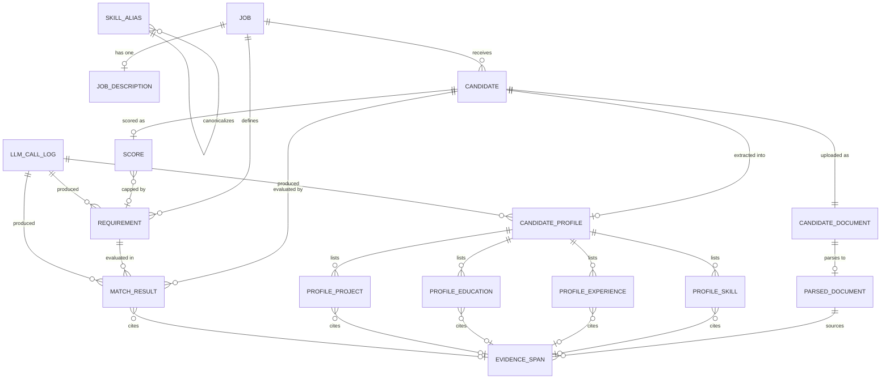

# AI CV Screener — Data Model

**Status:** Phase 1 (design only — no migrations exist yet)
**Last updated:** 2026-09-06
**Companion documents:** [product-spec.md](product-spec.md) · [architecture.md](architecture.md)

---

## 1. Conventions

- **Primary keys** are UUIDs, generated by the application. Uploaded files and candidates are referenced in URLs; sequential integers would leak how many candidates a job has received.
- **Table names** are singular `snake_case` (`job`, `match_result`). Column names are `snake_case`.
- **Timestamps** are `TIMESTAMPTZ`, always UTC. Every table has `created_at`; mutable tables also have `updated_at`.
- **Enumerations** are PostgreSQL native `ENUM` types, listed in §3. A native enum gives a database-level guarantee that no invalid state exists, which a `TEXT` column with an application-side check does not.
- **Money-like values** (weights, scores, coverage) use `NUMERIC`, never floating point, so a score recomputed from stored rows reproduces exactly.
- **Deletes** are hard deletes with `ON DELETE CASCADE` from `job` downward. There is no soft-delete layer in the MVP; a real retention and deletion workflow is a documented gap.

---

## 2. Entity relationship diagram



`SKILL_ALIAS` is a standalone lookup table with no foreign keys into the pipeline; it is shown for completeness.

---

## 3. Enumerations

| Type | Values | Used by |
|---|---|---|
| `requirement_category` | `EDUCATION`, `TECHNICAL_SKILL`, `EXPERIENCE`, `PROJECT`, `SOFT_SKILL_OTHER` | `requirement` |
| `requirement_origin` | `LLM_EXTRACTED`, `HR_ADDED` | `requirement` |
| `requirement_spec_type` | `EDUCATION_MIN`, `GPA_MIN`, `EXPERIENCE_MIN`, `SKILL`, `INTERNSHIP_MIN`, `LANGUAGE_PRESENT`, `EXPERIENCE_IN_FIELD`, `CERTIFICATION_PRESENT` | `requirement` |
| `jd_source_type` | `PASTED`, `UPLOADED` | `job_description` |
| `candidate_status` | `UPLOADED`, `PARSING`, `PARSED`, `EXTRACTING`, `EXTRACTED`, `SCORING`, `SCORED`, `FAILED` | `candidate` |
| `candidate_failure_reason` | `CORRUPT_FILE`, `NO_TEXT_LAYER`, `UNSUPPORTED_LANGUAGE`, `PARSE_TIMEOUT`, `EXTRACTION_FAILED`, `MATCHING_FAILED` | `candidate` |
| `match_verdict` | `MATCHED`, `PARTIAL`, `NO_EVIDENCE`, `NEEDS_REVIEW` | `match_result` |
| `match_method` | `DETERMINISTIC_EXACT`, `DETERMINISTIC_ALIAS`, `DETERMINISTIC_DURATION`, `DETERMINISTIC_STRUCTURED`, `LLM_SEMANTIC`, `DOWNGRADED_UNVERIFIED` | `match_result` |
| `evidence_verification` | `VERIFIED_EXACT`, `VERIFIED_NORMALIZED`, `UNVERIFIED` | `evidence_span` |
| `recommendation_band` | `STRONG_MATCH`, `GOOD_MATCH`, `REVIEW`, `LOW_MATCH` | `score` |
| `score_status` | `COMPUTED`, `UNDEFINED_NO_WEIGHT`, `UNDEFINED_NO_DECIDABLE` | `score` |
| `date_precision` | `DAY`, `MONTH`, `YEAR`, `UNKNOWN` | `profile_experience` |
| `llm_purpose` | `JD_EXTRACTION`, `PROFILE_EXTRACTION`, `SEMANTIC_MATCH` | `llm_call_log` |
| `llm_source` | `LIVE`, `FIXTURE` | `llm_call_log` |
| `llm_status` | `SUCCESS`, `SCHEMA_INVALID`, `PROVIDER_ERROR`, `TIMEOUT` | `llm_call_log` |

`match_verdict` gained `NEEDS_REVIEW` in [ADR-0012](decisions/0012-structured-screening-criteria.md). It is not a softer `NO_EVIDENCE`: the two say opposite things about the document. `NO_EVIDENCE` means the CV shows nothing for the criterion; `NEEDS_REVIEW` means it shows something that could not be read safely — a grade with no scale, a criterion outside the supported vocabulary. Only the second is a statement about the screener rather than about the document, which is why it is excluded from the arithmetic instead of being valued at zero.

`candidate_status` carries transient states (`PARSING`, `EXTRACTING`, `SCORING`) as well as settled ones. They exist for two concrete reasons: the UI needs per-file progress during a batch, and a candidate sitting in a transient state past a timeout is how a job lost to a server restart is detected (see [architecture.md §7](architecture.md#7-processing-model)).

---

## 4. Entities

### 4.1 `job`

| Column | Type | Null | Notes |
|---|---|---|---|
| `id` | UUID | no | PK |
| `title` | TEXT | no | `CHECK length(title) BETWEEN 1 AND 200` |
| `requirements_confirmed_at` | TIMESTAMPTZ | **yes** | `NULL` = not confirmed. **This is the gate.** |
| `created_at` / `updated_at` | TIMESTAMPTZ | no | |

There is deliberately **no `status` column.** Display status is derived: has a JD? has requirements? is `requirements_confirmed_at` set? have candidates finished? A stored status would duplicate state that is already knowable and drift out of sync with it.

### 4.2 `job_description`

| Column | Type | Null | Notes |
|---|---|---|---|
| `id` | UUID | no | PK |
| `job_id` | UUID | no | FK → `job`, **UNIQUE** |
| `source_type` | `jd_source_type` | no | |
| `source_filename` | TEXT | yes | Display only, never used as a path |
| `raw_text` | TEXT | no | `CHECK length(raw_text) BETWEEN 1 AND 100000` |
| `text_sha256` | CHAR(64) | no | Cache key for requirement extraction |
| `created_at` | TIMESTAMPTZ | no | |

One JD per job in the MVP, enforced by the unique constraint. Replacing a JD replaces the row. JD *history* would need this constraint relaxed and an `is_active` flag; it is not needed to demonstrate anything and is left out.

### 4.3 `requirement`

| Column | Type | Null | Notes |
|---|---|---|---|
| `id` | UUID | no | PK |
| `job_id` | UUID | no | FK → `job` |
| `text` | TEXT | no | One atomic, testable criterion |
| `category` | `requirement_category` | no | |
| `must_have` | BOOLEAN | no | |
| `weight` | NUMERIC(5,2) | no | `CHECK weight >= 0`. Default **3** when `must_have`, **1** otherwise |
| `display_order` | INTEGER | no | Stable ordering for the review table |
| `origin` | `requirement_origin` | no | |
| `spec_type` | `requirement_spec_type` | yes | Set on a structured criterion; `NULL` on a legacy free-text row |
| `subject` | TEXT | yes | The thing named: a degree level, a skill, or a language |
| `threshold_value` | NUMERIC(6,2) | yes | The bar: months for a duration, a grade for GPA |
| `threshold_scale` | NUMERIC(4,2) | yes | GPA only — the scale the recruiter says the threshold is out of |
| `proposed_text` | TEXT | yes | What the LLM originally proposed |
| `proposed_category` | `requirement_category` | yes | " |
| `proposed_must_have` | BOOLEAN | yes | " |
| `llm_call_id` | UUID | yes | FK → `llm_call_log` |
| `created_at` / `updated_at` | TIMESTAMPTZ | no | |

`EXPERIENCE_IN_FIELD` is the only type that carries a `subject` **and** a `threshold_value`. Every branch of the original constraint demanded one or the other and forbade the pair, so migration `e7c95a2f1b08` drops and recreates it with a branch for the new type — a CHECK expression cannot be amended in place.

**The four structured columns are shape-checked by the database, not only by the API.** `ck_requirement_spec_is_complete` is a `CASE` over `spec_type`: a subject-bearing type must carry a subject and no numbers, `GPA_MIN` must carry both a value and a scale, `EXPERIENCE_MIN` must carry a value, and a row with no `spec_type` must carry none of the four. It is written as `CASE ... ELSE FALSE` rather than as a chain of `IN` tests because a NULL `spec_type` makes `spec_type IN (...)` evaluate to NULL, and PostgreSQL **accepts** a CHECK that evaluates to NULL — which let a malformed row through during development.

`text` is still written for a structured criterion, as the human-readable rendering of the spec (`structured_match.describe`), so every existing display, export and score breakdown keeps working against one without knowing it is structured.

The three `proposed_*` columns are written once at extraction and never updated. They cost almost nothing and buy something valuable: `proposed_* != current` is exactly the set of human corrections to machine output — a labeled evaluation signal that accumulates from ordinary use, which is what the specification promises in feature F3. They are `NULL` for `HR_ADDED` requirements.

*Alternative rejected:* a full `requirement_revision` audit table. It would capture every intermediate edit, which nothing needs; before-and-after is the whole signal.

### 4.4 `candidate`

| Column | Type | Null | Notes |
|---|---|---|---|
| `id` | UUID | no | PK |
| `job_id` | UUID | no | FK → `job` |
| `display_name` | TEXT | yes | **Display only.** See §5. |
| `status` | `candidate_status` | no | Default `UPLOADED` |
| `stage_started_at` | TIMESTAMPTZ | yes | When the current stage began — stuck-candidate detection |
| `failure_reason` | `candidate_failure_reason` | yes | Set only when `status = FAILED` |
| `failure_detail` | TEXT | yes | Human-readable detail; never a stack trace |
| `created_at` / `updated_at` | TIMESTAMPTZ | no | |

`CHECK ((status = 'FAILED') = (failure_reason IS NOT NULL))` — a failed candidate always has a reason, and a non-failed one never does. The database enforces the product rule that failures are reported honestly.

### 4.5 `candidate_document`

| Column | Type | Null | Notes |
|---|---|---|---|
| `id` | UUID | no | PK |
| `candidate_id` | UUID | no | FK → `candidate`, **UNIQUE** |
| `original_filename` | TEXT | no | Display only — **never** used to build a path |
| `stored_path` | TEXT | no | Generated from `id`; no client-controlled component |
| `content_type` | TEXT | no | Verified by magic bytes, not by extension |
| `size_bytes` | INTEGER | no | `CHECK size_bytes > 0` |
| `page_count` | INTEGER | yes | Known after parsing |
| `file_sha256` | CHAR(64) | no | Duplicate detection within a job |
| `uploaded_at` | TIMESTAMPTZ | no | |

### 4.6 `parsed_document`

| Column | Type | Null | Notes |
|---|---|---|---|
| `id` | UUID | no | PK |
| `document_id` | UUID | no | FK → `candidate_document`, **UNIQUE** |
| `full_text` | TEXT | no | Normalized text — the substrate all evidence verifies against |
| `normalization_version` | TEXT | no | Which normalizer produced `full_text` |
| `page_offsets` | JSONB | no | `[{"page":1,"start":0,"end":1423}, ...]` — maps char offset → page |
| `char_count` | INTEGER | no | |
| `page_count` | INTEGER | no | |
| `has_text_layer` | BOOLEAN | no | `false` ⇒ scanned/image-only ⇒ candidate fails honestly |
| `language_detected` | TEXT | yes | ISO code; non-English is flagged, not silently processed |
| `injection_flags` | JSONB | yes | `[{"pattern":"...","offset":N,"excerpt":"..."}]` — flagged, never stripped |
| `multi_column_pages` | JSONB | yes | `[1]` — pages whose text sits in separated columns, so the flattened reading order is unreliable |
| `text_sha256` | CHAR(64) | no | Cache key for profile extraction |
| `parser_name` / `parser_version` | TEXT | no | Extraction quality is parser-dependent; record which one ran |
| `created_at` | TIMESTAMPTZ | no | When extraction ran. Named for the project-wide convention in section 1, not `parsed_at`. |

`page_offsets` is the reason page numbers never have to be asked of the model: given a verified character offset, the page is a lookup.

`multi_column_pages` is stored rather than derived later for the same reason as `injection_flags`: the column geometry is only visible while the PDF is open, and by the time anything reads `full_text` the positions are gone. It is nullable, so an older parse has no opinion about its layout instead of a fabricated empty one. Nothing downstream reorders the text on the strength of it — it becomes a `MULTI_COLUMN_LAYOUT` warning telling a recruiter to open the original file, which is the honest response to "the reading order here cannot be trusted".

### 4.7 `candidate_profile`

The header row for extracted content. **This is the scoring input**, and what it does *not* contain is as deliberate as what it does (§5).

| Column | Type | Null | Notes |
|---|---|---|---|
| `id` | UUID | no | PK |
| `candidate_id` | UUID | no | FK → `candidate`, **UNIQUE** |
| `parsed_document_id` | UUID | no | FK → `parsed_document` |
| `llm_call_id` | UUID | yes | FK → `llm_call_log` — which extraction produced this |
| `prompt_version` | TEXT | no | Denormalized for query convenience in evaluation |
| `created_at` | TIMESTAMPTZ | no | |

### 4.8 Profile item tables

Four small tables holding the profile's contents. Each row may cite one `evidence_span`.

**`profile_skill`**

| Column | Type | Null | Notes |
|---|---|---|---|
| `id` | UUID | no | PK |
| `profile_id` | UUID | no | FK → `candidate_profile` |
| `raw_name` | TEXT | no | As written in the CV |
| `normalized_name` | TEXT | no | Casefolded, punctuation-stripped — computed by our code, not the model |
| `evidence_span_id` | UUID | yes | FK → `evidence_span` |

**`profile_experience`**

| Column | Type | Null | Notes |
|---|---|---|---|
| `id` | UUID | no | PK |
| `profile_id` | UUID | no | FK → `candidate_profile` |
| `role_title` | TEXT | no | |
| `organization` | TEXT | yes | |
| `start_date` / `end_date` | DATE | yes | Day defaulted to the 1st when unknown |
| `date_precision` | `date_precision` | no | |
| `is_current` | BOOLEAN | no | |
| `description` | TEXT | yes | |
| `evidence_span_id` | UUID | yes | FK → `evidence_span` |

CV dates are messy — `"2019 – present"`, `"Jan 2020"`, `"2021"`. Storing a `DATE` alone would silently invent precision the document does not have. `date_precision` lets the duration matcher state its own uncertainty: "3+ years" against `YEAR`-precision dates is a legitimately different confidence than against `MONTH` precision, and Phase 7 can decide `PARTIAL` rather than pretending to certainty.

**`profile_education`**

| Column | Type | Null | Notes |
|---|---|---|---|
| `id` | UUID | no | PK |
| `profile_id` | UUID | no | FK → `candidate_profile` |
| `degree` | TEXT | yes | |
| `field_of_study` | TEXT | yes | |
| `institution` | TEXT | yes | See the honesty note in §5 |
| `completion_year` | INTEGER | yes | |
| `evidence_span_id` | UUID | yes | FK → `evidence_span` |

**`profile_project`**

| Column | Type | Null | Notes |
|---|---|---|---|
| `id` | UUID | no | PK |
| `profile_id` | UUID | no | FK → `candidate_profile` |
| `name` | TEXT | no | |
| `description` | TEXT | yes | |
| `technologies` | TEXT[] | yes | |
| `evidence_span_id` | UUID | yes | FK → `evidence_span` |

*Alternative rejected:* one `jsonb` column on `candidate_profile`. It matches the LLM's output shape more directly and would be less schema to write. It was rejected because the deterministic matcher needs an index on `normalized_name` and real date arithmetic on roles, evidence links are genuinely foreign keys rather than nested fields, and the evidence validity rate is a `COUNT(*) ... GROUP BY verification_status` over rows rather than a jsonb traversal. The matcher's ability to run fast and fully offline decided it.

### 4.9 `evidence_span`

The pivot of the whole design.

| Column | Type | Null | Notes |
|---|---|---|---|
| `id` | UUID | no | PK |
| `parsed_document_id` | UUID | no | FK → `parsed_document` |
| `quoted_text` | TEXT | no | **The only field the model supplies** |
| `start_char` / `end_char` | INTEGER | yes | Located by our verifier; `NULL` when `UNVERIFIED` |
| `page_number` | INTEGER | yes | Derived from `page_offsets` |
| `verification_status` | `evidence_verification` | no | |
| `normalization_version` | TEXT | no | Which normalizer the verification ran under |
| `created_at` | TIMESTAMPTZ | no | |

`CHECK (verification_status = 'UNVERIFIED') = (start_char IS NULL)` — a verified span always has a location, and an unverified one never claims to.

Recording `normalization_version` on the span matters: if the normalizer changes in a later phase, previously verified spans may no longer match. The version makes that a visible, explainable event rather than a mysterious drop in evidence validity.

### 4.10 `match_result`

One row per (requirement, candidate) pair.

| Column | Type | Null | Notes |
|---|---|---|---|
| `id` | UUID | no | PK |
| `requirement_id` | UUID | no | FK → `requirement` |
| `candidate_id` | UUID | no | FK → `candidate` |
| `verdict` | `match_verdict` | no | The verdict actually used for scoring |
| `decided_by` | `match_method` | no | Deterministic vs LLM — makes the split measurable |
| `reason` | TEXT | no | Shown to the recruiter. Evidence-first wording |
| `evidence_span_id` | UUID | yes | FK → `evidence_span` |
| `raw_verdict` | `match_verdict` | yes | What the model said before any downgrade |
| `downgraded` | BOOLEAN | no | Default `false` |
| `llm_call_id` | UUID | yes | FK → `llm_call_log`; `NULL` for deterministic decisions |
| `created_at` | TIMESTAMPTZ | no | |

Constraints:

- `UNIQUE (requirement_id, candidate_id)` — one verdict per pair, always.
- `CHECK (verdict::text IN ('NO_EVIDENCE', 'NEEDS_REVIEW') OR evidence_span_id IS NOT NULL)` — **a positive verdict without evidence cannot be stored.** The evidence-first principle is a database constraint, not a convention someone might forget. `NEEDS_REVIEW` joined the exemption in ADR-0012: an unresolved criterion is not a positive verdict, and there is often nothing in the document to point at. It is compared as `::text` so the constraint can be created in the same migration that adds the enum value — PostgreSQL refuses to use a freshly added label in the transaction that added it.

Keeping `raw_verdict` alongside `verdict` is what makes downgrades measurable: the count of `downgraded = true` rows is the hallucinated-or-injected-evidence rate, reported directly in Phase 13.

### 4.11 `score`

| Column | Type | Null | Notes |
|---|---|---|---|
| `id` | UUID | no | PK |
| `candidate_id` | UUID | no | FK → `candidate`, **UNIQUE** |
| `status` | `score_status` | no | |
| `weighted_sum` | NUMERIC(10,4) | yes | Σ(weight × match_value) |
| `total_weight` | NUMERIC(10,4) | yes | Σ(weight) |
| `score_raw` | NUMERIC(9,8) | yes | `weighted_sum / total_weight`, 0–1 |
| `score` | INTEGER | yes | `round(score_raw × 100)`, `CHECK score BETWEEN 0 AND 100` |
| `must_have_coverage` | NUMERIC(9,8) | yes | `NULL` when the job has no must-haves |
| `band_raw` | `recommendation_band` | yes | Band implied by `score` alone |
| `band` | `recommendation_band` | yes | Band after the must-have guard |
| `capped` | BOOLEAN | no | Default `false` |
| `capped_by_requirement_id` | UUID | yes | FK → `requirement` — which must-have triggered the cap |
| `scoring_config_version` | TEXT | no | Identifies the value/threshold bundle used |
| `computed_at` | TIMESTAMPTZ | no | |

**Edge case, decided here rather than in Phase 9.** If a job has no requirements, or every weight is `0`, the score is not `0` — it is **undefined**. `status = UNDEFINED_NO_WEIGHT`, and `score`, `band`, and the arithmetic columns are `NULL`. There is a second way to reach the same place: if every criterion came back `NEEDS_REVIEW`, `status = UNDEFINED_NO_DECIDABLE`. Criteria were asked and none could be answered, which is a different fact from none having been asked, so it is a different status. Returning `0` would render as "terrible candidate" when the truth is "nothing was asked of them". This is the same distinction as `NO_EVIDENCE` versus "does not have the skill", applied to arithmetic, and it removes the division-by-zero case by construction.

`scoring_config_version` names the bundle `{MATCHED: 1.0, PARTIAL: 0.5, NO_EVIDENCE: 0.0, thresholds: 90/75/60, must_have_guard: on}`. Changing any constant means a new version string, so a stored score is always interpretable against the rules that produced it.

### 4.12 `llm_call_log`

| Column | Type | Null | Notes |
|---|---|---|---|
| `id` | UUID | no | PK |
| `purpose` | `llm_purpose` | no | |
| `model` | TEXT | no | e.g. `claude-opus-5` |
| `prompt_version` | TEXT | no | |
| `input_sha256` | CHAR(64) | no | Cache key. **The input text itself is never stored here** |
| `source` | `llm_source` | no | `LIVE` or `FIXTURE` |
| `status` | `llm_status` | no | |
| `attempt` | SMALLINT | no | 1 or 2 — the retry policy is one retry |
| `input_tokens` / `output_tokens` | INTEGER | yes | Cost and evaluation reporting |
| `latency_ms` | INTEGER | yes | |
| `error_detail` | TEXT | yes | |
| `raw_response_excerpt` | TEXT | yes | Truncated; only on `SCHEMA_INVALID`, for debugging |
| `job_id` / `candidate_id` | UUID | yes | Correlation |
| `created_at` | TIMESTAMPTZ | no | |

Storing `input_sha256` rather than the input is a deliberate privacy choice: CV text must not end up in a log table that gets exported, backed up, or shipped to an aggregator. The hash is enough to key the cache and to prove two calls had identical input.

### 4.13 `skill_alias`

| Column | Type | Null | Notes |
|---|---|---|---|
| `id` | UUID | no | PK |
| `canonical_name` | TEXT | no | Normalized form, e.g. `postgresql` |
| `alias` | TEXT | no | Normalized form, e.g. `postgres`, **UNIQUE** |
| `created_at` | TIMESTAMPTZ | no | |

A curated seed list (`postgres → postgresql`, `js → javascript`, `k8s → kubernetes`, …). Small, boring, and it removes a whole class of pairs from the LLM's workload — cheaper, faster, and perfectly reproducible.

---

## 5. The fairness boundary, expressed structurally

The specification says sensitive attributes are excluded from scoring "by construction". In this model that has a precise meaning.

**`candidate.display_name` exists; `candidate_profile` has no name column.** The name lives on the display entity so a recruiter can tell candidates apart. It is not part of the profile, and the matching and scoring services read only from `candidate_profile` and its item tables. The scorer is therefore *structurally incapable* of reading a name — not because it was asked not to.

**Columns that deliberately do not exist anywhere in this schema:**

`date_of_birth` · `age` · `gender` · `photo` / `image` · `nationality` · `ethnicity` · `religion` · `marital_status` · `family_status` · `home_address` · `postal_code` · `phone` · `email`

Phase 14 adds a test that inspects the live schema and fails if any column with these names appears. That converts a principle into a regression test.

**Honesty note on `profile_education.institution`.** University name is a well-documented bias proxy, and unlike the fields above it *is* in the scoring input. It is kept because education requirements are sometimes genuinely about accreditation or field of study, and dropping it would make those requirements unanswerable. This is a real, acknowledged limitation rather than a claim of neutrality; the same applies to `organization` on `profile_experience`. The project's position is that naming a residual risk is worth more than pretending the schema removed it.

---

## 6. Reconstructibility

The specification requires that recomputing a score from stored rows reproduces the stored value exactly. Every input is persisted:

```
score.score
  = round( Σ(requirement.weight × value(match_result.verdict)) / Σ(requirement.weight) × 100 )
                    │                        │                          │
                    │                        │                          └── requirement.weight
                    │                        └── match_result.verdict (UNIQUE per requirement+candidate)
                    └── value() from scoring_config_version
```

Nothing in that expression is held only in memory, and no term depends on a model call. `score.weighted_sum` and `score.total_weight` are stored as well, so a mismatch can be localized to either the arithmetic or the inputs. Phase 9 verifies this by recomputing from the database and asserting equality; Phase 14 keeps it verified with a property test asserting the per-requirement breakdown sums to the stored total.

The must-have guard is equally reconstructible: `band_raw` records what the score alone implied, `band` what was displayed, and `capped_by_requirement_id` names the requirement responsible.

---

## 7. Staleness and invalidation

Derived rows must never outlive the inputs they were derived from.

| Change | Invalidates | Cost to recover |
|---|---|---|
| Requirement `text` or `category` edited | `match_result` for that requirement, then every affected `score` | LLM re-run for the affected pairs |
| Requirement added or deleted | `match_result` set changes; every `score` in the job | LLM run for the new requirement only |
| Requirement `weight` or `must_have` edited | **`score` only** — verdicts do not depend on weight | Free; pure recomputation |
| JD replaced | Requirements re-extracted; job unconfirmed | Full re-run |
| Candidate document replaced | Everything downstream for that candidate | Full re-run for one candidate |

Requirement `text` and `category` are immutable while `requirements_confirmed_at` is set; changing them requires explicitly unconfirming, which makes the invalidation a deliberate act with visible consequences rather than a silent corruption. Weight and must-have stay editable throughout, because the row above shows their edit is free.

This table is the concrete payoff of keeping the LLM out of the scoring path: **the change a recruiter is most likely to make repeatedly — re-weighting — is the one that costs nothing.**

---

## 8. Indexes

| Table | Index | Serves |
|---|---|---|
| `job` | `(created_at DESC)` | Job list |
| `job_description` | `UNIQUE (job_id)` | One JD per job |
| `requirement` | `(job_id, display_order)` | Requirement review table |
| `candidate` | `(job_id, status)` | Batch progress, ranked list |
| `candidate_document` | `UNIQUE (candidate_id)`, `(file_sha256)` | Duplicate detection |
| `parsed_document` | `UNIQUE (document_id)`, `(text_sha256)` | Profile-extraction cache |
| `candidate_profile` | `UNIQUE (candidate_id)` | |
| `profile_skill` | `(profile_id, normalized_name)` | Deterministic skill matching |
| `evidence_span` | `(parsed_document_id)` | Candidate detail view |
| `match_result` | `UNIQUE (requirement_id, candidate_id)`, `(candidate_id)` | Score breakdown |
| `score` | `UNIQUE (candidate_id)` | Ranking |
| `llm_call_log` | `(input_sha256, prompt_version, model)`, `(created_at DESC)` | Cache lookup, cost reporting |
| `skill_alias` | `UNIQUE (alias)` | Alias lookup |

Ranking joins `candidate` (filtered by `job_id`) to `score`. At MVP scale — tens of candidates per job — the `candidate(job_id, status)` index plus the unique key on `score.candidate_id` is sufficient; no composite ranking index is added speculatively.

---

## 9. Ranking and tie-breaking

Phase 10 needs a deterministic order. Defined here so it is fixed before implementation:

1. `score.score` **descending** — candidates with either undefined status sort last, never as `0`.
2. `score.must_have_coverage` **descending**, nulls last.
3. Count of `match_result.verdict = 'MATCHED'` **descending** — prefers concrete evidence over accumulated partials at the same score.
4. `candidate.created_at` **ascending**, then `candidate.id` — a total order, so repeated runs on identical data always produce an identical list.

Candidates with `status = FAILED` are returned in a separate group with their `failure_reason`, never merged into the ranking and never silently dropped.

---

## 10. pgvector: the deferred path

pgvector is **not** part of the MVP schema. Nothing in the pipeline needs vector search: alias and exact matching settle the easy requirement/skill pairs, and the LLM settles the hard ones. Adding it now would mean a Postgres extension, an embedding-model dependency, an index, and a similarity threshold to tune — with no evaluation set until Phase 13 to demonstrate that any of it improves a verdict.

The schema is arranged so adding it later is purely additive:

- An `embedding vector(N)` column on `profile_skill` and on `requirement`, plus an index, is a single migration touching no existing column and no existing query.
- Because `match_result.decided_by` already records which mechanism produced each verdict, an embedding pre-filter would arrive as a new enum value (`DETERMINISTIC_EMBEDDING`) and its effect on cost and agreement would be measurable against the existing Phase 13 baseline — rather than being adopted on faith.

The two plausible future cases are a cheap pre-filter to reduce LLM calls at larger scale, and cross-job candidate search. Both are explicitly post-MVP.

---

## 11. Resolved open questions

The four questions left open in [product-spec.md §19](product-spec.md#19-resolved-decisions) are now settled.

| # | Question | Resolution |
|---|---|---|
| 1 | Should an unevidenced must-have cap the band? | **Yes.** Any `must_have` requirement at `NO_EVIDENCE` caps the displayed band at `REVIEW`, annotated with the requirement that caused it. The numeric score is unchanged and still shown; `band_raw` preserves the uncapped band. The candidate stays fully visible and openable — this is never a rejection. Controlled by `scoring_config_version` and switchable off. |
| 2 | Default weights | **`must_have = 3`, `nice_to_have = 1`**, per-requirement editable by HR. A 3:1 ratio is strong enough to matter and small enough that three nice-to-haves still outweigh one must-have — which is precisely why the separate `must_have_coverage` figure and the guard exist rather than trying to encode "hard requirement" in a weight. |
| 3 | Cross-job score comparability | **The UI actively discourages it.** Scores are only meaningful within one job; the requirement set and weights differ between jobs. No screen places scores from different jobs side by side, and the score label states it is relative to this job's requirements. |
| 4 | Evidence granularity | **Sentence-level spans**, with `start_char`/`end_char` retained on every verified span. Sentences are what a recruiter can actually read and check; character offsets keep finer granularity (highlighting a phrase within the sentence) available later with no schema change. |

---

## 12. Known gaps in this model

- **No user, role, or tenant tables.** Single workspace; `created_by` has nowhere to point.
- **No retention or deletion workflow.** Cascading deletes exist, but nothing schedules or requests them — a blocker for real candidate data.
- **No JD version history.** One JD per job by constraint.
- **No requirement revision history.** Only the original proposal and the current value.
- **No cross-job entities.** A candidate belongs to exactly one job; the same person applying twice is two rows, and the model cannot tell.
